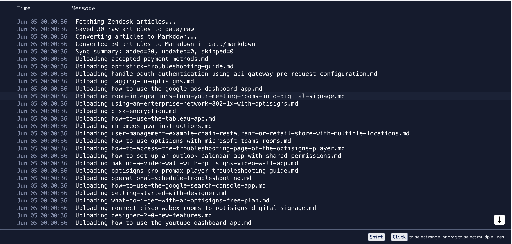
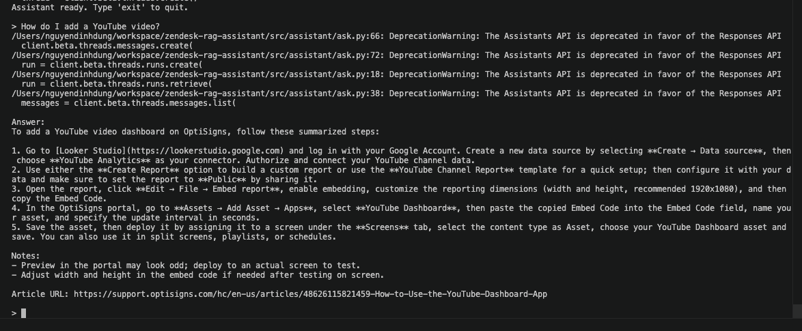

# Zendesk RAG Assistant

RAG assistant for OptiSigns support documentation.

## Features

* Fetches 30 support articles from the OptiSigns Zendesk API
* Converts HTML articles to Markdown
* Uploads Markdown files to an OpenAI Vector Store via API
* Uses OpenAI Assistant + File Search for retrieval
* Performs daily delta sync using SHA256 content hashes
* Uploads only new or updated articles

## Setup

Create `.env`:

```bash
OPENAI_API_KEY=...
ZENDESK_SUBDOMAIN=support.optisigns.com
VECTOR_STORE_ID=...
ASSISTANT_ID=...
```

Install dependencies:

```bash
pip install -r requirements.txt
```

## Run Locally

Run the complete sync pipeline:

```bash
python -m src.main
```

Run tests:

```bash
python -m pytest
```

## Docker

Build:

```bash
docker build -t zendesk-rag-assistant .
```

Run:

```bash
docker run --env-file .env zendesk-rag-assistant
```

## Delta Sync

The sync job calculates a SHA256 hash for each generated Markdown file and stores the results in `data/article_hashes.json`.

On subsequent runs, hashes are compared to detect:

* New articles (`added`)
* Updated articles (`updated`)
* Unchanged articles (`skipped`)

Only new or updated files are uploaded to the OpenAI Vector Store.

### Production Note

The current implementation stores hashes locally in `article_hashes.json`. This works for local execution and demonstrates delta detection logic.

Because DigitalOcean App Platform Jobs run in ephemeral containers, this state is not guaranteed to persist between executions. In a production environment, hash state should be stored in persistent storage such as a database or object storage (e.g. DigitalOcean Spaces).

## Retrieval

Markdown files are uploaded to an OpenAI Vector Store.

The project uses OpenAI's built-in chunking and embedding pipeline for document indexing and retrieval. Retrieved chunks are provided to the Assistant through the File Search tool.

## Daily Job

The sync pipeline is deployed as a scheduled DigitalOcean App Platform Job.

Schedule:

```text
0 0 * * * (00:00 UTC)
```

Workflow:

```text
Fetch Zendesk articles
→ Convert HTML to Markdown
→ Detect changed files using SHA256 hashes
→ Upload new/updated files to OpenAI Vector Store
```

Successful job execution:




## Assistant Validation

Assistant answering:

> How do I add a YouTube video?

with source citations from uploaded documentation.


